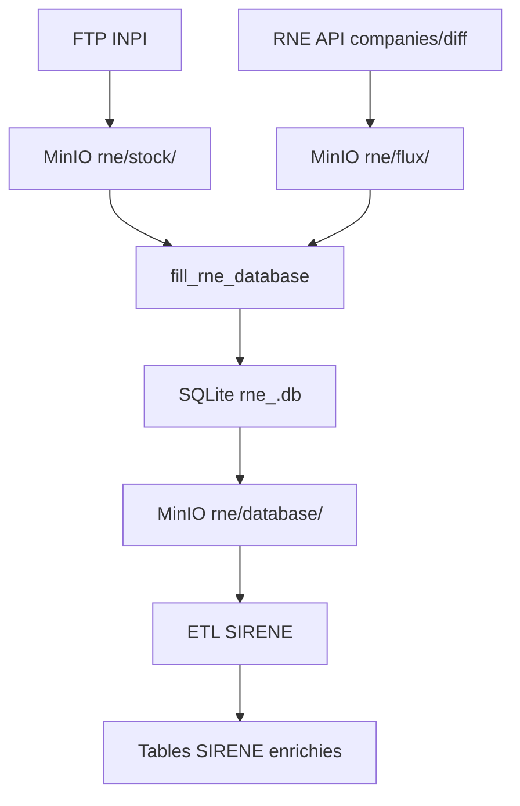

# RNE_Data_Processing

# 1. Résumé exécutif

Le pipeline RNE industrialise la récupération, la normalisation et la mise à disposition des données du Registre National des Entreprises (RNE) à partir de deux sources officielles :  
- le **stock annuel INPI** (ZIP contenant l’historique complet),  
- les **flux quotidiens différentiels** via l’API `companies/diff`.

Ces données brutes sont stockées sur **MinIO**, validées via **Pydantic**, transformées en tables normalisées dans une base **SQLite versionnée**, puis intégrées dans les tables dirigeant, unité légale, siège et immatriculation de la base **SIRENE** via un ETL dédié.

Le traitement complète s’appuie sur :  
- **Airflow** pour l’orchestration,  
- **MinIO** pour le stockage objet,  
- **SQLite** pour la consolidation incrémentale versionnée,  
- **Pydantic** pour la validation stricte des payloads JSON,  
- **pandas** pour le nettoyage avancé des dirigeants,  
- un **client API robuste** (pagination `searchAfter`, retries, réduction dynamique du `pageSize`).

Des garde-fous structurés garantissent la cohérence des données :  
upsert par SIREN, suppression des doublons globaux, contrôles volumétriques, exclusion des journées incomplètes, logs et notifications Mattermost.

---

# 2. Pipeline RNE — Vue d’ensemble, architecture et flux

Cette section regroupe en une seule vue cohérente :  
- le fonctionnement global du pipeline,  
- les composants techniques utilisés,  
- le flux de données de bout en bout,  
- les principales opérations réalisées sur les données RNE.

## 2.1 Vue d’ensemble du flux de données

Le pipeline suit une chaîne de traitement complète :

1. **Acquisition des données brutes**
   - Téléchargement du **stock INPI** via script shell (`get_stock.sh`), extraction JSON, dépôt sur MinIO (`rne/stock`).
   - Récupération des **flux quotidiens** via l’API RNE (`companies/diff`) orchestrée par Airflow :
     - pagination `searchAfter`,
     - gestion du `pageSize`,
     - retries automatiques,
     - stockage en JSON ND compressé (`.json.gz`) dans MinIO (`rne/flux`).

2. **Construction / reprise de la base SQLite RNE**
   - Lecture de `latest_rne_date.json`,
   - Création ou reprise de `rne_<date>.db`,
   - Ingestion du stock (lors du bootstrap) puis des flux (ordre chronologique, dernier flux ignoré),
   - Validation Pydantic (`RNECompany`),
   - Mapping vers les tables internes (UL, siège, dirigeants, immatriculation, établissements, activités),
   - Nettoyage : upsert par SIREN, suppression des doublons, `VACUUM`,
   - Contrôles volumétriques (ex. ~20M UL).

3. **Versioning et publication**
   - Compression de la base,
   - Dépôt sur MinIO (`rne/database`),
   - Mise à jour de `latest_rne_date.json`.

4. **Intégration dans l’ETL SIRENE**
   - Téléchargement de la base RNE versionnée,
   - Prétraitements pandas sur les dirigeants,
   - Mise à jour des tables UL et sièges via `UPDATE` puis `INSERT OR IGNORE`,
   - Copie directe de la table immatriculation,
   - Reconstruction des tables dérivées.

## 2.2 Architecture des composants

### Airflow
- Orchestration complète du processus via deux DAGs :
  - `get_flux_rne` : collecte des flux quotidiens,
  - `fill_rne_database` : construction incrémentale de la base SQLite.
- Nettoyage automatique, gestion du séquencement, gestion des erreurs.

### MinIO
- Stockage durable des artefacts :
  - `rne/stock/` : stock JSON initial,
  - `rne/flux/` : flux journaliers `.json.gz`,
  - `rne/database/` : bases versionnées,
  - `latest_rne_date.json` : métadonnées de reprise.

### SQLite
- Base locale normalisée regroupant les 7 tables cibles :
  - `unite_legale`, `siege`, `dirigeant_pp`, `dirigeant_pm`,  
    `immatriculation`, `etablissement`, `activite`.
- Index sur SIREN/SIRET,
- Versioning complet via upload `.gz`.

### Pydantic
- Validation stricte de chaque payload JSON RNE via `RNECompany`,
- Garantit la structure source avant toute transformation.

### pandas
- Nettoyage des dirigeants (PP/PM) :
  - tri,
  - dédoublonnage,
  - uniformisation de la casse,
  - regroupement de rôles.

### Client API RNE
- Gestion de la pagination `searchAfter`,
- Réduction automatique du `pageSize` si erreur 500,
- Retries automatiques,
- Authentification par token.

## 2.3 Flux de traitement détaillé

### a) Stock initial
- Téléchargement ZIP via FTP,
- Extraction JSON,
- Upload MinIO,
- Suppression locale immédiate.

### b) Flux quotidien
- Appels API RNE pour chaque date « dernière date traitée → J-1 »,
- Pagination ordonnée par SIREN,
- JSON ND concaténé + compression,
- Upload MinIO même en cas d’erreur partielle.

### c) Construction / mise à jour SQLite
- Reprise d’une version existante si disponible,
- Ingestion du stock (si nouveau pipeline),
- Ingestion chronologique des flux,
- Normalisation via mapping interne,
- Upsert par SIREN,
- Dédoublonnage, `VACUUM`, indexation.

### d) Versioning
- Compression `.gz`,
- Dépôt MinIO `rne/database/`,
- Mise à jour `latest_rne_date.json`.

### e) Intégration SIRENE
- Prétraitements dirigeants,
- Mise à jour UL et siège,
- Copie des immatriculations,
- Reconstruction des tables dérivées.

## 3. Schéma fonctionnel du pipeline

## 4. Inputs & Outputs
### Inputs
- Stock historique INPI ZIP → JSON
- Flux différentiel quotidien `.json.gz`
- Métadonnées : `latest_rne_date.json`
- Base précédente : `rne_<date>.db.gz`

### Outputs
- Base SQLite versionnée
- Tables normalisées (UL, siège, dirigeants, immatriculation, établissements, activités)
- Tables SIRENE enrichies
- Notifications Mattermost

## 5. Mapping Source → Cible

## 5. Tableau de mapping source → cible

Les tableaux suivants détaillent la correspondance entre les chemins JSON et les colonnes finales (tables `rne.db` qui alimentent ensuite les tables SIRENE).

### 5.1 `unite_legale`

| Source JSON | Table cible | Champ cible | Type cible | Transformation / logique | Commentaires |
| --- | --- | --- | --- | --- | --- |
| `siren` | `unite_legale` | `siren` | TEXT | Affectation directe par `map_rne_company_to_ul`. | Sert aussi de clé primaire pour les suppressions de doublons avant insertion. |
| `formality.diffusionINSEE` | `unite_legale` | `statut_diffusion` | TEXT | Copie directe. | Propagé plus tard dans SIRENE (`statut_diffusion_unite_legale`). |
| `formality.formeJuridique`, `content.natureCreation.formeJuridique`, `identite.entreprise.formeJuridique/formeJuridiqueInsee` | `unite_legale` | `nature_juridique` | TEXT | `get_forme_juridique` priorise la forme issue de la formalité, sinon nature de création, sinon identite. | Combine plusieurs sources pour fiabiliser la forme juridique. |
| `createdAt` ou `content.natureCreation.dateCreation` | `unite_legale` | `date_creation` | TEXT | `get_date_creation` choisit `createdAt` puis la date de création déclarée. | Format conservé tel que fourni. |
| `formality.content.formeExerciceActivitePrincipale` | `unite_legale` | `forme_exercice_activite_principale` | TEXT | Copie directe. | Sert aussi de première valeur pour la nature d’entreprise (voir immatriculation). |
| `formality.content.natureCessationEntreprise.etatAdministratifInsee` | `unite_legale` | `etat_administratif` | TEXT | Copie directe. | |
| `identite.entreprise.denomination` | `unite_legale` | `denomination` | TEXT | Copie directe. | |
| `identite.entreprise.nomCommercial` | `unite_legale` | `nom_commercial` | TEXT | Copie directe. | |
| `identite.entreprise.effectifSalarie` | `unite_legale` | `tranche_effectif_salarie` | TEXT | Copie directe. | |
| `identite.entreprise.dateImmat` | `immatriculation` | `date_immatriculation` | DATE | Copie directe. | |
| `identite.entreprise.indicateurAssocieUnique` | `immatriculation` | `indicateur_associe_unique` | TEXT | Valeur bool sérialisée en texte par SQLite. | |
| `identite.entreprise.dateDebutActiv` | `immatriculation` | `date_debut_activite` | TEXT | Copie directe. | |
| `identite.description.{montantCapital, capitalVariable, deviseCapital, dateClotureExerciceSocial, duree}` | `immatriculation` | `capital_social`, `capital_variable`, `devise_capital`, `date_cloture_exercice`, `duree_personne_morale` | REAL/TEXT/INT | Copie directe. | |
| `detailCessationEntreprise.{dateRadiation, dateEffet, dateCessationTotaleActivite}` | `immatriculation` | `date_radiation` | DATE | Première date non nulle (radiation > effet > cessation). | Valeur priorisée via `get_detail_cessation`. |
| `updatedAt` | Toutes tables | `date_mise_a_jour` | DATE | Affecté à `unite_legale.date_mise_a_jour` et réutilisé lors de l’insertion des enfants (`siege`, `dirigeant_*`, `etablissement`, `activite`, `immatriculation`). | Permet un suivi temporel homogène. |
| `adresseEntreprise.adresse.*` | `unite_legale` | `adresse` | TEXT | Les champs structurés sont convertis en objet `Adresse` puis concaténés via `format_address()`. | Prépare l’export SIRENE et ElasticSearch. |
| `composition` ou `identite.entrepreneur` | `dirigeant_pp` / `dirigeant_pm` | voir §3.3 | cf. ci-dessous | cf. ci-dessous | cf. ci-dessous |
| `etablissementPrincipal` + `autresEtablissements` | `siege`, `etablissement`, `activite` | voir §3.2 | cf. ci-dessous | cf. ci-dessous | cf. ci-dessous |

### 5.2 `siege`, `etablissement` et `activite`

| Source JSON | Table cible | Champ cible | Type cible | Transformation / logique | Commentaires |
| --- | --- | --- | --- | --- | --- |
| `etablissementPrincipal.descriptionEtablissement.siret` | `siege` | `siret` | TEXT | Copie directe. | Sert aussi de clé pour les activités de siège. |
| `etablissementPrincipal.descriptionEtablissement.{nomCommercial, enseigne}` | `siege` | `nom_commercial`, `enseigne` | TEXT | Copie directe. | |
| `etablissementPrincipal.adresse.{...}` | `siege` | Colonnes d’adresse | TEXT | Mapping champ à champ via `map_rne_siege_to_ul`. | Toutes les composantes sont injectées (pays, code INSEE, etc.). |
| `etablissementPrincipal.activites[]` | `activite` | Colonnes `code_category`, `indicateur_*`, `date_debut`, `form_exercice`, `categorisation_*`, `code_ape`, `activite_rattachee_eirl` | TEXT/BOOL/DATE | Chaque activité devient une ligne `activite` avec `siret = siret_du_siege`. | La date de mise à jour provient d’`updatedAt`. |
| `autresEtablissements[].descriptionEtablissement.siret` | `etablissement` | `siret` | TEXT | Copie directe. | Les activités associées héritent du même SIRET. |
| `autresEtablissements[].activites[]` | `activite` | mêmes colonnes | TEXT/BOOL/DATE | Même logique que pour le siège. | |
| `activites[].formeExercice` + indicateur principal | `immatriculation` | `nature_entreprise` | TEXT | `get_nature_entreprise_list` construit un set (forme principale + activités principales des établissements) puis il est sérialisé en JSON. | Champ multi-source, peut être nul si aucun indicateur principal n’est renseigné. |

### 5.3 Dirigeants

| Source JSON | Table cible | Champ cible | Type cible | Transformation / logique | Commentaires |
| --- | --- | --- | --- | --- | --- |
| `composition.pouvoirs[].typeDePersonne == "INDIVIDU"` | `dirigeant_pp` | colonnes identitaires | TEXT | `map_rne_dirigeant_pp_to_ul` recopie les champs `nom`, `nomUsage`, `prenoms`, `genre`, `dateDeNaissance`, `nationalite`, `situationMatrimoniale`. Les listes de prénoms sont jointes avec un espace. | Le rôle stocké est `roleEntreprise`. |
| `composition.pouvoirs[].typeDePersonne == "ENTREPRISE"` | `dirigeant_pm` | `siren_dirigeant`, `denomination`, `role`, `pays`, `forme_juridique` | TEXT | `map_rne_dirigeant_pm_to_ul` nettoie le SIREN (suppression des espaces) et recopie les autres champs. | |
| `personnePhysique.identite.entrepreneur.descriptionPersonne` (cas personne physique sans composition) | `dirigeant_pp` | mêmes colonnes | TEXT | `get_dirigeants` renvoie une liste avec l’entrepreneur individuel. | Les champs rôle restent `None`. |
| `dirigeants` (tous types) | `unite_legale` | `nom`, `nom_usage`, `prenom` | TEXT | Pour les personnes physiques, la première ligne de dirigeant est recopiée sur l’UL afin de disposer d’un triplet nom/prénom. | Permet de distinguer les entreprises individuelles dans la base SIRENE. |
| `updatedAt` + `file_path` | `dirigeant_pp`/`dirigeant_pm` | `date_mise_a_jour`, `file_name` | DATE/TEXT | Ajoutés lors de l’insertion dans SQLite. | Utilisés ensuite pour le nettoyage et la traçabilité. |

### 5.4 Immatriculation

| Source JSON | Table cible | Champ cible | Type cible | Transformation / logique | Commentaires |
| --- | --- | --- | --- | --- | --- |
| `identite.entreprise.dateImmat` | `immatriculation` | `date_immatriculation` | DATE | Copie directe. | |
| `detailCessationEntreprise.{dates}` | `immatriculation` | `date_radiation` | DATE | Sélection de la première date disponible (priorité radiations). | |
| `identite.entreprise.indicateurAssocieUnique` | `immatriculation` | `indicateur_associe_unique` | TEXT | Valeur bool convertie en texte lors de l’insertion. | |
| `identite.description.montantCapital` | `immatriculation` | `capital_social` | REAL | Copie directe. | |
| `identite.description.dateClotureExerciceSocial` | `immatriculation` | `date_cloture_exercice` | TEXT | Copie directe. | |
| `identite.description.capitalVariable` | `immatriculation` | `capital_variable` | TEXT | Valeur booléenne sérialisée. | |
| `identite.description.deviseCapital` | `immatriculation` | `devise_capital` | TEXT | Copie directe. | |
| `identite.description.duree` | `immatriculation` | `duree_personne_morale` | INT | Copie directe. | |
| `identite.entreprise.dateDebutActiv` | `immatriculation` | `date_debut_activite` | TEXT | Copie directe. | |
| `nature_entreprise` (set issu des formes d’exercice) | `immatriculation` | `nature_entreprise` | TEXT | Sérialisation JSON (`json.dumps`) de la liste construite par `get_nature_entreprise_list`. | Multi-sources (activité principale, sièges, établissements). |

### 5.5 Mise à jour SIRENE et traitements complémentaires

| Étape | Source JSON / table RNE | Table SIRENE cible | Transformation / logique |
| --- | --- | --- | --- |
| Mise à jour `unite_legale` | `db_rne.unite_legale` | `unite_legale` | `UPDATE` ajoute `from_rne=TRUE` et `date_mise_a_jour_rne`. `INSERT OR IGNORE` copie toutes les colonnes pertinentes pour les SIREN absents. |
| Mise à jour `siege` | `db_rne.siege` | `siege` | `UPDATE` met à jour `date_mise_a_jour_rne`, `INSERT` ajoute les sièges manquants avec les colonnes d’adresse RNE. |
| Recréation `dirigeant_pp` / `dirigeant_pm` | `db_rne.dirigeant_*` | `dirigeant_*` | Les tables RNE sont lues par chunks, normalisées (`uppercase`, groupby, concaténation des rôles) puis insérées dans la base SIRENE. |
| Copie `immatriculation` | `db_rne.immatriculation` | `immatriculation` | Duplication stricte (structure + contenu) en une seule requête SQL. |

---
## 6. Artefacts générés
- `stock_rne.json` (sur MinIO)
- `rne_flux_YYYY-MM-DD.json.gz`
- `rne_<date>.db` local + version `.gz` sur MinIO
- `latest_rne_date.json`
- Tables SIRENE enrichies

## 7. Réutilisabilité du pipeline
*Section à compléter manuellement.*

## 8. Limites techniques / risques
*Section vide comme demandé.*

