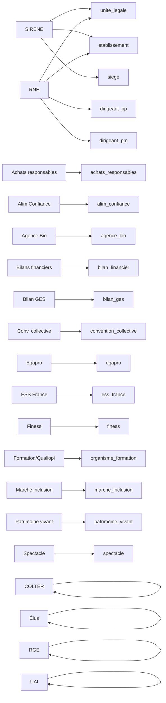

# Aperçu des pipelines de données

Ce document synthétise les sources présentes dans `workflows/data_pipelines`, leur rôle, les tables produites et un schéma global des flux.

## 1. Sources et traitement appliqué
- **SIRENE (INSEE)** : charge les flux/stock SIRENE et les fusionne avec les données RNE pour alimenter les tables principales `unite_legale`, `etablissement`, `siege`, `dirigeant_pp`, `dirigeant_pm` ainsi que les tables dérivées de comptage/historique dans SQLite.
- **RNE (Registre National des Entreprises)** : complète les données SIRENE via les indicateurs `from_rne`/`date_mise_a_jour_rne` et insère les entités manquantes dans `unite_legale` et `etablissement`.
- **Achats responsables** : importe un CSV data.gouv et crée la table `achats_responsables` (siren, périmètre du label, indicateur binaire).
- **Alim’Confiance** : importe le contrôle sanitaire et marque un siren via `est_alim_confiance` dans la table homonyme.
- **Agence Bio** : récupère les certifications bio et produit `agence_bio` (siret, siren, liste des identifiants bio, statut).
- **Bilans financiers** : synthèse financière par siren (`bilan_financier` avec CA, résultat, dates).
- **Bilan GES** : indique la présence d’un bilan d’émissions (`bilan_ges`, champ `bilan_ges_renseigne`).
- **COLTER / Élus** : territoires et élus associés, créant `colter` (codes territoriaux) et `elus` (nom, prénom, fonction).
- **Convention collective** : associe IDCC aux siren/siret via `convention_collective` (listes par établissement et unité légale).
- **Egapro** : marque les entreprises ayant renseigné l’index égalité pro (`egapro_renseignee`).
- **ESS France** : indique l’appartenance à l’ESS (`est_ess_france`).
- **FINESS** : signale les établissements sanitaires via `liste_finess` (clé siret).
- **Organismes de formation (Qualiopi)** : table `organisme_formation` (siren, identifiants, flag qualiopi).
- **Marché de l’inclusion (SIAE)** : table `marche_inclusion` (type SIAE, flag `est_siae`).
- **Patrimoine vivant** : label Entreprise du Patrimoine Vivant (`est_patrimoine_vivant`).
- **RGE (travaux énergétiques)** : certifications RGE par siret via `liste_rge`.
- **Entrepreneur de spectacle** : table `spectacle` (flag et statut).
- **Tables UAI (établissements scolaires)** : table `uai` (siret → liste d’UAI).
- **Autres enrichissements** : consommés par l’ETL et l’indexation Elasticsearch pour enrichir les unités légales/établissements (cf. champs dérivés dans `es_fields.py`).

## 2. Tables finales et mapping des variables
- **unite_legale** (fusion SIRENE + RNE) : colonnes d’état civil, activité, effectifs, statut diffusion, indicateurs `from_insee`/`from_rne` et dates de mise à jour ; les champs `nom`, `nature_juridique`, `activite_principale` proviennent du stock/flux SIRENE, tandis que `from_rne`, `date_mise_a_jour_rne` et les insertions complémentaires proviennent du RNE.
- **etablissement** (SIRENE + RNE) : informations d’adresse, activité, effectifs, géolocalisation, diffusion, dates de mise à jour ; colonnes `date_mise_a_jour_rne`/`date_fermeture_etablissement` complètent SIRENE avec le RNE.
- **siege** : même structure que `etablissement` mais filtrée sur l’établissement siège (données SIRENE + mises à jour RNE).
- **flux_unite_legale / flux_etablissement** : tables tampon pour écraser/mettre à jour les tables principales à partir des flux SIRENE.
- **dirigeant_pp / dirigeant_pm** : dirigeants personnes physiques/morales extraits du RNE puis injectés dans la base SIRENE (création et index sur siren).
- **ancien_siege / historique_unite_legale / count_etablissement / count_etablissement_ouvert** : tables dérivées pour historiques et agrégats SIRENE.
- **Enrichissements par source spécialisée** (tables dédiées jointes ensuite sur siren ou siret) :
  - `achats_responsables` (label achats responsables)
  - `alim_confiance` (contrôles sanitaires)
  - `agence_bio` (certifications bio)
  - `bilan_financier` (CA, résultat)
  - `bilan_ges` (déclaration GES)
  - `colter` (codes territoriaux) & `elus` (élu·e·s)
  - `convention_collective` (IDCC par siret/siren)
  - `egapro` (index égalité)
  - `ess_france` (appartenance ESS)
  - `finess` (structures sanitaires)
  - `organisme_formation` (Qualiopi)
  - `marche_inclusion` (SIAE)
  - `patrimoine_vivant` (label EPV)
  - `rge` (certifications RGE)
  - `spectacle` (entrepreneurs de spectacle)
  - `uai` (établissements scolaires)

## 3. Schéma Mermaid (sources → tables finales)

